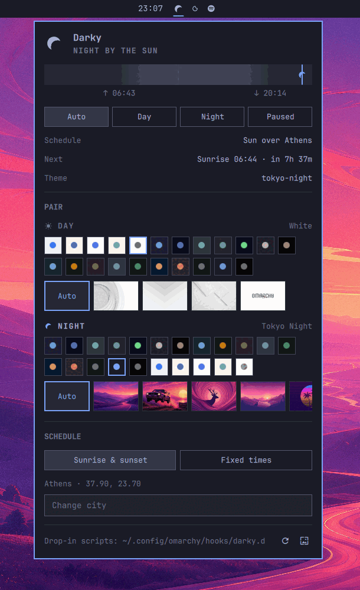
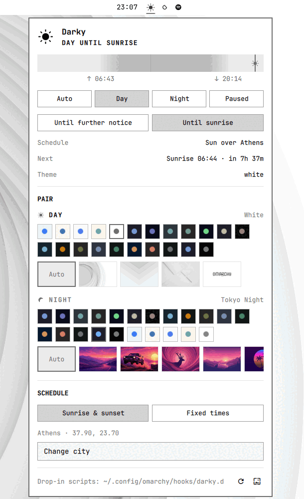

# Darky

**Your Omarchy theme and wallpaper, following the sun.**

Darky is an [Omarchy](https://omarchy.org) (Quattro) shell plugin. Pick a theme
and a background for day and another pair for night, tell it where you live, and
it swaps them at sunrise and sunset — no systemd service, no shell script glued
to a timer.

| Night | Day |
| --- | --- |
|  |  |

## Why this exists

Omarchy 4 moved the whole desktop into one Quickshell process with a plugin
system. Day/night theming was the last piece still living outside it: a
[darkman](https://gitlab.com/WhyNotHugo/darkman) systemd service, a script in
`~/.local/share/darkman/`, a theme pair in one config file and a wallpaper choice
nowhere in particular.

Darky is a friendly attempt to make that unnecessary on Omarchy. darkman is a
fine, portable daemon and Darky borrows its ideas outright — including its
`light-mode.d` / `dark-mode.d` script contract, so anything you wrote for it
keeps working. Darky just moves the job inside the shell, where the themes and
wallpapers already live, and puts all of it behind one panel.

**Looking for something smaller?** [NightMan](https://github.com/codefriendly/omarchy-nightman)
does the same schedule but only flips `org.gnome.desktop.interface color-scheme`,
leaving your Omarchy theme and wallpaper alone. If you want apps to follow the
sun while your theme stays put, use NightMan instead — it is the lighter tool for
that job, and Darky learned a lot from reading it.

## Requirements

- Omarchy 4 (Quattro) or newer, with the Quickshell plugin system
- `jq`, `curl`, `flock`, `gsettings` — all present on a stock Omarchy install
- `omarchy-theme-set`, `omarchy-theme-bg-set`, `omarchy-theme-color`,
  `omarchy-hook` — shipped with Omarchy

Nothing else. The sun math runs locally, so the schedule keeps working offline;
the network is touched only while you type in the city search.

## Install

```bash
omarchy plugin add https://github.com/mehiel/mehiel.darky.git --enable
```

Then add the **Darky** widget to your bar from `Setup > Plugins`, or click the
sun/moon that appears in it. The panel is the whole configuration surface.

To remove it:

```bash
omarchy plugin remove mehiel.darky
```

Your settings stay in `~/.local/state/darky/` so a reinstall picks up where you
left off. Delete that directory to forget them.

## First run

Darky seeds itself from whatever you already have:

- location from `~/.config/darkman/config.yaml`
- theme pair from `~/.config/omarchy/light-dark.conf`
- otherwise `white` / `tokyo-night` and 07:00 / 19:00

If darkman is still running, retire it — two schedulers fighting over one theme
is a bad time:

```bash
systemctl --user disable --now darkman.service
mv ~/.config/omarchy/hooks/post-boot.d/darkman-theme.sh{,.sample}  # if you have one
```

## Using it

The bar icon is a sun during the day and a crescent at night, dimmed when the
schedule is paused, so you can read the state without opening anything. Click it
for the panel, middle-click to toggle.

- **Auto** follows the schedule. **Day** and **Night** pin the desktop.
  **Paused** stops Darky touching anything.
- Pinning asks whether you mean it *until further notice* or only *until the next
  sunrise/sunset*. Temporary choices survive a shell restart and expire on their
  own.
- **Pair** is two rows of theme chips — every installed Omarchy theme, light ones
  offered for day and dark ones for night — with the backgrounds of the selected
  theme underneath. `Auto` leaves the wallpaper to the theme.
- **Schedule** is sunrise/sunset for a city, or fixed times. City search is
  type-ahead; the coordinates and timezone are stored once and used offline
  afterwards.
- The ribbon across the top is the local day, night shaded, with a marker at now.

Missed transitions are caught up on login and after suspend, so a laptop that
slept through sunset wakes up dark.

### Bind a key

```lua
-- ~/.config/hypr/bindings.lua
o.bind("SUPER + ALT + T", "Toggle day/night",
  os.getenv("HOME") .. "/.config/omarchy/plugins/mehiel.darky/bin/darky-toggle")
```

`darky-toggle` asks the shell first and falls back to `darky-apply` when the
shell is not running, so the bind also works from a TTY.

## Command line

```bash
omarchy-shell mehiel.darky status    # JSON: mode, appearance, next event, pair, errors
omarchy-shell mehiel.darky toggle    # flip until the next transition
omarchy-shell mehiel.darky light     # or: dark — temporary, same as toggle
omarchy-shell mehiel.darky auto      # drop the override, return to the schedule
omarchy-shell mehiel.darky modeDay   # or: modeNight, modePaused, modeAuto — persistent
omarchy-shell mehiel.darky apply     # re-apply the current mode
omarchy-shell mehiel.darky refresh   # rescan installed themes and backgrounds
```

## Configuration

Everything the panel writes lives in `~/.local/state/darky/settings.json`. Edit
it by hand if you prefer; Darky watches the file and repaints the desktop the
moment it changes.

```json
{
  "mode": "auto",
  "schedule": "solar",
  "dayStart": "07:00",
  "nightStart": "19:00",
  "location": {
    "name": "Athens",
    "latitude": 37.9,
    "longitude": 23.7,
    "timezone": "Europe/Athens"
  },
  "light": { "theme": "white", "background": "" },
  "dark":  { "theme": "tokyo-night", "background": "" }
}
```

| Key | Meaning |
| --- | --- |
| `mode` | `auto`, `day`, `night` or `paused` |
| `schedule` | `solar` (needs `location`) or `fixed`; falls back to `fixed` without a location |
| `dayStart`, `nightStart` | `HH:MM`, used by the fixed schedule and whenever solar data is unusable |
| `location` | name, latitude, longitude, IANA timezone |
| `light`, `dark` | theme slug and absolute background path; empty background means the theme's own |

Other files:

| Path | What it is |
| --- | --- |
| `~/.local/state/darky/mode` | the last applied mode, one word, for scripts that want to ask |
| `~/.local/state/darky/override.json` | the current temporary choice, if any |
| `~/.config/omarchy/light-dark.conf` | kept in sync so Omarchy's own tooling agrees with the panel |

## Hooks

Anything in `~/.config/omarchy/hooks/darky.d/` runs after the desktop already
looks right, with the mode, theme slug and background path as arguments:

```bash
# ~/.config/omarchy/hooks/darky.d/50-editor
mode="$1" theme="$2" background="$3"
sed -i "s/^set background=.*/set background=$mode/" ~/.vimrc
```

A single `~/.config/omarchy/hooks/darky` script works too — that is Omarchy's
convention, and `omarchy-hook darky` is what Darky calls.

darkman's directories still run as well, after the hooks above:

```text
~/.local/share/light-mode.d/   ~/.local/share/dark-mode.d/
/usr/share/light-mode.d/       /usr/share/dark-mode.d/
```

## Without the shell

```bash
bin/darky-apply light|dark [theme-slug] [background-path]
```

That is the whole transition — theme, background, `color-scheme`,
`light-dark.conf`, hooks — in one script. With no arguments beyond the mode it
reads `settings.json`, which is what makes it a working fallback when the shell
is down.

## Privacy

City search sends what you type to [Open-Meteo](https://open-meteo.com/)'s
geocoding API, and only while the field has two or more characters. Nothing else
leaves the machine: no IP geolocation, no telemetry, and sunrise and sunset are
computed locally with the NOAA solar algorithm. Open-Meteo's free API is
non-commercial; see their [terms](https://open-meteo.com/en/terms).

## Development

```bash
git clone https://github.com/mehiel/mehiel.darky ~/.config/omarchy/plugins/mehiel.darky
omarchy-restart-shell

node tests/model.test.js                          # solar math and settings logic
omarchy plugin validate .
/usr/lib/qt6/bin/qmllint *.qml                    # the Qt5 qmllint in PATH says nothing useful
```

| File | Role |
| --- | --- |
| `Model.js` | solar math (NOAA), schedule resolution, settings normalization — plain JS, runs under Node |
| `Service.qml` | state, timers, file watching, IPC |
| `Panel.qml` | the configuration panel |
| `BarWidget.qml`, `DarkyIcon.qml`, `DayRibbon.qml`, `ThemeSlot.qml` | bar icon, sun/moon mark, day ribbon, theme picker |
| `bin/darky-scan` | theme catalog and first-run seed |
| `bin/darky-apply` | the apply path |
| `bin/darky-toggle` | the keybinding entry point |

Pull requests welcome. If something about the schedule looks wrong, the fastest
useful bug report is `omarchy-shell mehiel.darky status` plus your timezone.

## Credits

- [darkman](https://gitlab.com/WhyNotHugo/darkman) by Hugo Barrera, for the model
  and the script contract this keeps compatible.
- [NightMan](https://github.com/codefriendly/omarchy-nightman), for showing what
  a well-behaved appearance plugin looks like on Quattro.
- [Open-Meteo](https://open-meteo.com/) for city search, CC BY 4.0.

## License

MIT — see [LICENSE](LICENSE).
